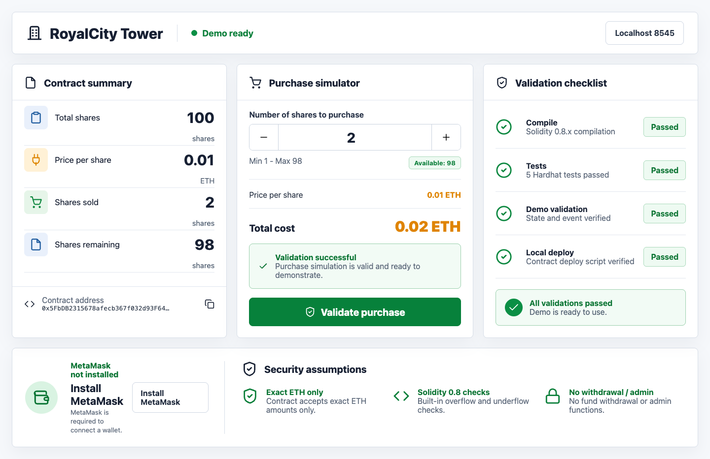
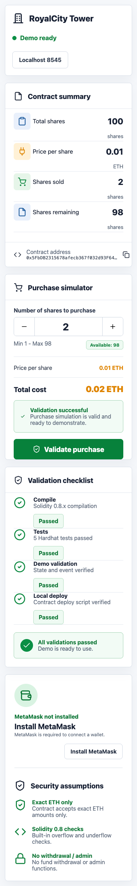
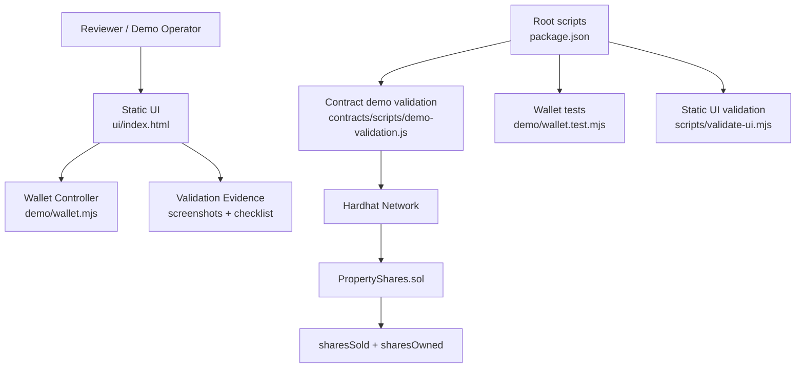
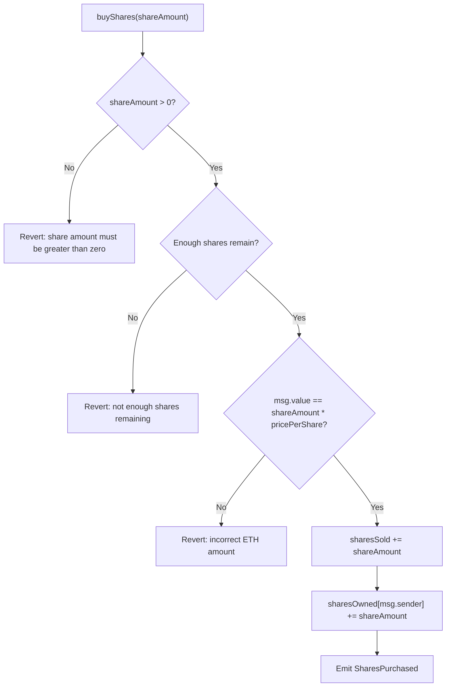
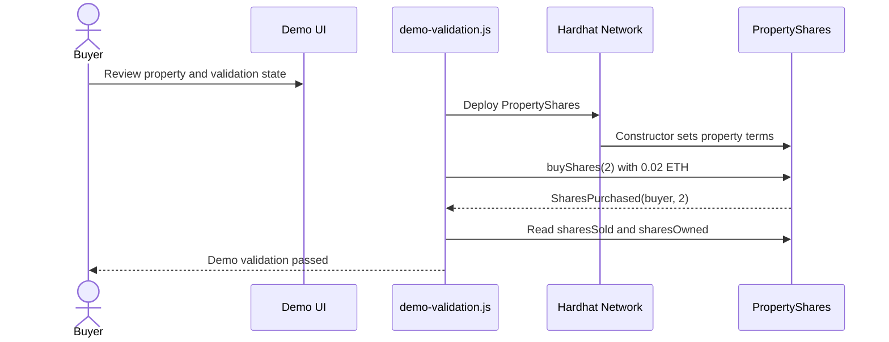
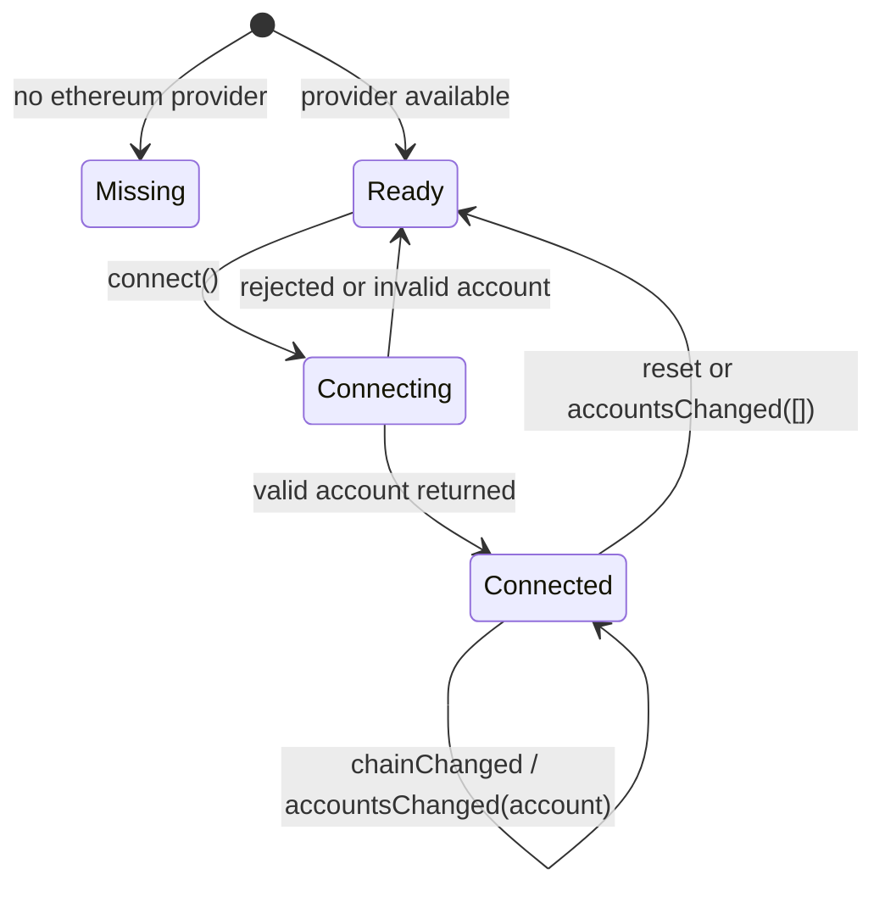
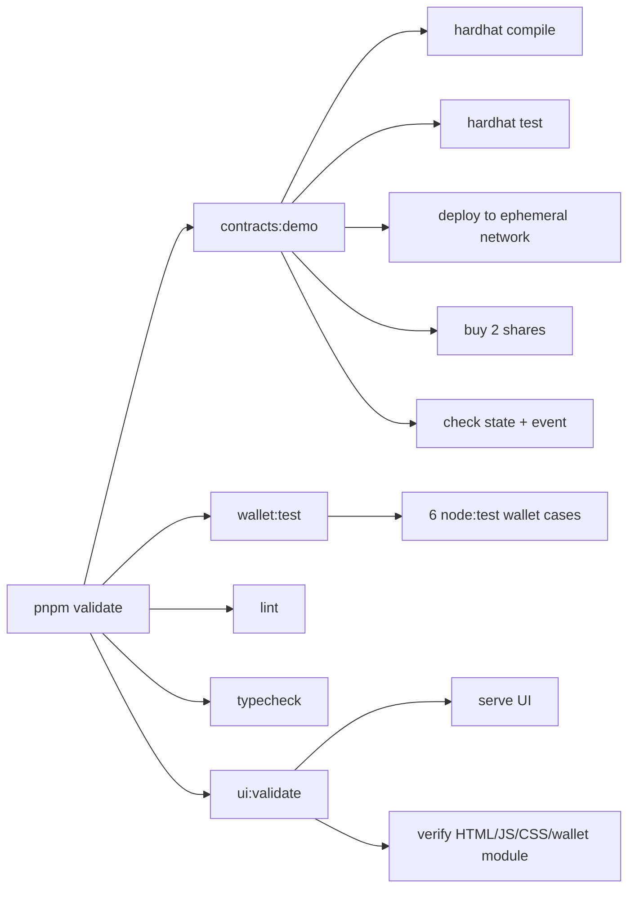

# Velixus Lab

Demo-ready assessment workspace for:

- Test 1: MetaMask wallet integration.
- Test 2: Solidity real estate fractional share purchase contract.

The project is intentionally scoped: it validates wallet connection behavior, deploys and tests a Solidity purchase contract, and provides a static reviewer UI. It does not add ERC20 tokenization, secondary markets, KYC, admin panels, or contract-connected frontend transactions beyond the assessment requirements.

## Demo Screens

Desktop:



Mobile:



## Repository Map

```text
.
├── contracts/
│   ├── contracts/PropertyShares.sol
│   ├── scripts/demo-validation.js
│   ├── scripts/deploy.js
│   └── test/PropertyShares.js
├── demo/
│   ├── wallet.mjs
│   ├── wallet.test.mjs
│   ├── video-outline.md
│   └── ui-*.png
├── scripts/
│   └── validate-ui.mjs
├── ui/
│   ├── index.html
│   └── src/
│       ├── main.js
│       └── styles.css
├── package.json
└── SPRINT.md
```

## Architecture



## Smart Contract

`contracts/contracts/PropertyShares.sol` implements one fixed property offering:

- `propertyName`: `RoyalCity Tower`
- `totalShares`: `100`
- `pricePerShare`: `0.01 ETH`
- `sharesSold`
- `sharesOwned(address => uint256)`
- `buyShares(uint256 shareAmount)` payable purchase entrypoint
- `SharesPurchased(address buyer, uint256 amount)` event

Purchase validation:



Contract interaction sequence:



## Wallet Integration

`demo/wallet.mjs` isolates MetaMask/provider behavior:

- detects `window.ethereum`
- uses `eth_requestAccounts`
- reads `eth_chainId`
- normalizes addresses and chain IDs before display
- handles rejected connections with generic UI errors
- responds to `accountsChanged` and `chainChanged`
- removes provider listeners on disposal

Wallet state flow:



## Static UI

The UI is static by design:

- no root frontend dependency install required
- no bundler required
- served by Python’s built-in HTTP server
- imports the shared wallet module directly
- mirrors the validated contract state and demo checklist

Start it:

```sh
pnpm run ui:dev
```

Open:

[http://127.0.0.1:5173/ui/](http://127.0.0.1:5173/ui/)

If port `5173` is busy:

```sh
python3 -m http.server 5174
```

Then open `http://127.0.0.1:5174/ui/`.

## Setup

Prerequisites:

- Node.js 22+
- pnpm 11+
- Python 3 for the static UI server

Install contract dependencies:

```sh
cd contracts
pnpm install
cd ..
```

Run full validation:

```sh
pnpm validate
```

Run the UI:

```sh
pnpm run ui:dev
```

## Validation Commands



Available scripts:

| Command | Purpose |
| --- | --- |
| `pnpm lint` | JS syntax checks for UI and validator scripts |
| `pnpm typecheck` | JS syntax checks for UI and wallet module |
| `pnpm test` | Hardhat contract tests + wallet tests |
| `pnpm validate` | Full contract, wallet, syntax, and UI validation |
| `pnpm run ui:dev` | Serve the static UI |
| `cd contracts && pnpm run deploy:local` | Deploy to a persistent local Hardhat node |

## Latest Validation Evidence

Fresh checks run locally:

- `pnpm lint`: passed
- `pnpm typecheck`: passed
- `pnpm test`: passed
  - 5 Hardhat contract tests
  - 6 wallet tests
- `pnpm validate`: passed
  - compiled contracts
  - ran contract tests
  - deployed `PropertyShares` to an ephemeral Hardhat network
  - bought 2 shares with `0.02 ETH`
  - verified `sharesSold`
  - verified `sharesOwned`
  - verified `SharesPurchased`
  - validated served static UI assets
- persistent local deploy: passed with `pnpm exec hardhat node` and `pnpm run deploy:local`
- source/security scan: no private-key-shaped authored values and no empty catch blocks

## Security Assumptions

- Wallet/provider data is treated as external input and normalized before display.
- Rejected MetaMask requests show a generic UI error and do not log raw provider error objects.
- The demo never stores or logs private keys or secrets.
- Solidity `^0.8.28` provides checked arithmetic.
- ETH validation is exact: `msg.value == shareAmount * pricePerShare`.
- Contract state is mutated only after validation.
- There are no external contract calls.
- There is no owner withdrawal path because custody management is outside the assessment scope.
- There are no admin-only paths.

## Demo Script

1. Run:

```sh
pnpm validate
```

2. Start UI:

```sh
pnpm run ui:dev
```

3. Open [http://127.0.0.1:5173/ui/](http://127.0.0.1:5173/ui/).
4. Show contract summary, purchase simulator, validation checklist, wallet panel, and security assumptions.
5. Show `contracts/contracts/PropertyShares.sol`.
6. Point out constructor values and validation-before-mutation logic.
7. Optional persistent deployment:

```sh
cd contracts
pnpm exec hardhat node
```

In another terminal:

```sh
cd contracts
pnpm run deploy:local
```

## AI-Assisted Build Process

This was built through Codex 5.5-style validation loops with specialized prompt passes for:

- Solidity contract correctness
- Hardhat tests and deployment validation
- wallet-provider state handling
- static UI implementation
- browser screenshot validation
- documentation and demo-readiness review

The workflow used looped verification rather than unverified generation: each major surface was checked by commands, source scans, or browser screenshots before publishing. No separate remote sub-agent artifacts are required to run or review the repository.
